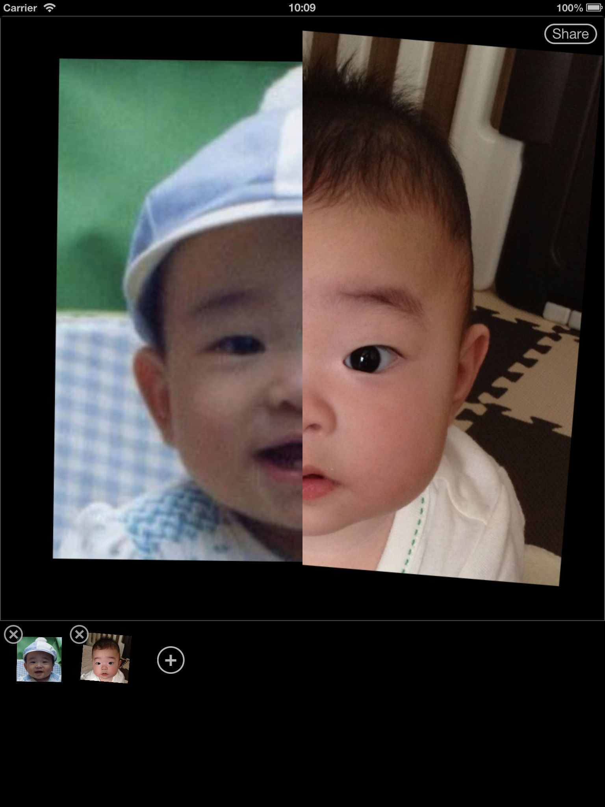

What is Like Alike?
--
You want someone to be alike you?

I do. That's why I wrote this small app to compare photo of my daughter and me.

Get Started
--
Press the + button to add your photo from library.

Add Photo
--
Scale and rotate your photo by using two fingers.

Mix Photos
--
Have fun mixing your photos!!

Delete Photo
--
Press the x button to delete photo.

Rearrange Photos
--
Long press the image to rearrange it.

Share
--
Let's share mixed photo with your family and friends!

* Twitter hashtag [#likealikeapp](https://twitter.com/search?q=%23likealikeapp&src=typd&mode=realtime)
* Facebook hashtag [#likealikeapp](https://www.facebook.com/hashtag/likealikeapp?fref=ts)

iPad is also supported
--
The bigger, the better!

Have more fun
--
You can use any kind of picture. Like apple to apple.

Be creative and have more fun!

iAd
--
You'll have some fun and I'll get some money. Fair enough?

Security
--
All your data are stored locally on your device.
No central server gathering your data, nor tracking your actions.

Support
--
Feel free to contact me by twitter [appbatake](https://twitter.com/appbatake)



